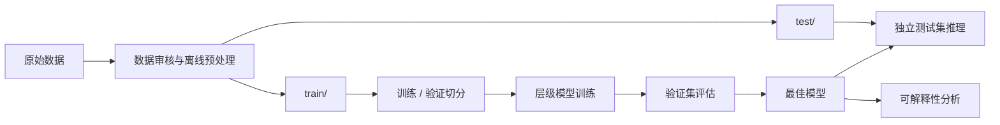
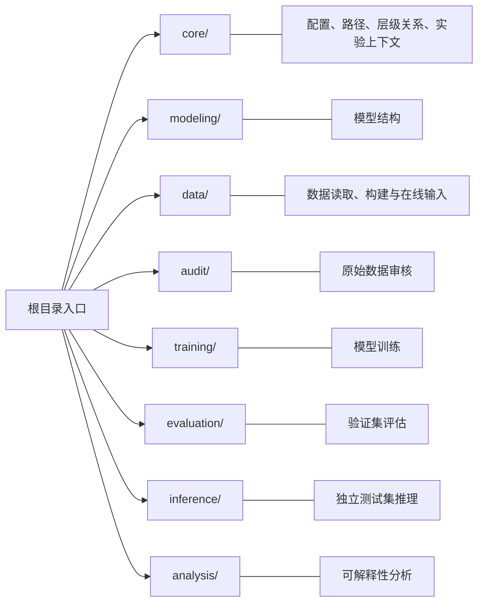

# 基于拉曼光谱的临床病原菌智能识别

## 1. 项目概述

本项目面向微生物拉曼光谱识别任务，构建了一套从原始光谱处理、模型训练到评估、推理和可解释性分析的完整层级分类实验系统。

以 `.arc_data` 格式的单条拉曼光谱为基础输入，通过统一的数据处理流程生成训练集和独立测试集，并根据数据目录结构自动构建类别层级关系。

在此基础上，完成不同分类层级下的模型训练、验证、独立测试以及模型解释分析。

### 1.1 核心功能

**原始数据处理**

- 原始 `.arc_data` 光谱读取与目录整理；
- 原始光谱质量审核与异常谱移除；
- 宇宙射线去除、基线校正、坏波段处理和统一波数轴插值；

**模型输入构建**

- 在线光谱标准化；
- RAW 域数据增强；
- SG 平滑与一阶导数特征构建；
- 支持 `base`、`smooth` 和 `d1` 等多通道 1D 光谱输入。

**层级分类训练**

- 根据训练目录自动构建层级标签树；
- 支持顶层全局分类模型；
- 支持在更细层级按照父类分别训练子模型；
- 自动维护层级类别映射、父子关系以及模型路由信息。

**模型评估与独立测试**

- 基于训练阶段固定验证集进行深度模型评估；
- 支持 PCA + SVM 作为传统机器学习基线；
- 支持单模型、真实父类路由和层级级联等评估方式；
- 支持对独立测试集进行逐谱预测和文件夹级多数投票。

**模型可解释性分析**

- Integrated Gradients（IG）输入归因；
- 中间网络层归因；
- SE 模块通道缩放统计；
- Train / Val embedding 的 UMAP 可视化。

### 1.2 层级分类任务

数据集通过目录结构表达类别层级

系统在扫描数据集时会自动解析目录结构，构建：

```text
level_1 → level_2 → ... → level_N
```

以及对应的父子关系：

```text
parent → children
```

因此，训练过程中不需要手工维护各层类别表

如果某个父类在下一层只有一个子类，则不需要额外训练分类模型，可以直接按照父子映射确定下一层类别

### 1.3 项目整体流程



## 2. 仓库结构与模块职责

项目采用按领域拆分的模块化结构

整体上可以分为：



`spectra/` 与 `common/` 提供可跨流程复用的基础工具

### 2.1 根目录入口

仓库根目录保留几个常用执行入口：

```text
拉曼光谱分类/
├─ train.py                          # 模型训练入口
├─ evaluate.py                       # 验证集模型评估入口
├─ infer.py                          # 独立测试集推理入口
├─ analyze.py                        # 可解释性分析入口
├─ AGENTS.md                         # Coding Agent 协作约束
└─ LICENSE                           # 项目许可证
```

这些脚本主要用于设置少量运行参数并调用 `ramanv2` 内部对应模块

### 2.2 核心配置与实验上下文

`ramanv2/core/` 负责整个项目共享的基础运行信息

各模块职责如下：

| 文件                   | 主要职责                                                     |
| ---------------------- | ------------------------------------------------------------ |
| `config.py`            | 项目的主要可编辑配置源，维护数据集、输入、模型、训练、执行和分析配置 |
| `config_file.py`       | 负责 `shared / model / resolved` 等配置快照的读取与写入      |
| `input_spec.py`        | 根据输入配置生成确定的模型输入规格                           |
| `paths.py`             | 统一解析项目根目录、数据目录及其它通用路径                   |
| `hierarchy.py`         | 负责层级标签选择、父类约束以及 logit mask                    |
| `experiment_reader.py` | 从实验目录或具体 run 中恢复配置和训练任务信息                |
| `run_context.py`       | 管理实验根目录、单次 run 的目录、配置快照和日志上下文        |
| `hierarchy_meta.py`    | 负责 `hierarchy_meta.json` 的读取、写入和增量合并            |

`core/config.py` 是常规实验流程的主要配置入口，而实验运行后生成的配置快照用于保证后续评估、推理和分析能够恢复训练时的实际设置

`hierarchy_meta.json` 则负责保存不同层级之间的类别关系以及模型组织信息，是连接训练与后续推理流程的重要元数据

### 2.3 模型层

模型结构集中在 `ramanv2/modeling/`

各模块职责如下：

| 文件            | 主要职责                                                     |
| --------------- | ------------------------------------------------------------ |
| `classifier.py` | 定义主模型，包括多尺度 stem、CNN/direct backbone、encoder 和 pooling |
| `factory.py`    | 根据配置构建模型，并检查输入规格与模型配置是否匹配           |
| `heads.py`      | 实现 `Linear` 与 `CosineClassifier` 分类头                   |
| `layers.py`     | 实现残差块、SE、位置编码和基础卷积模块                       |
| `spec.py`       | 定义并校验 `ModelSpec` 等模型结构规格                        |

具体模型见后面详细讲述

### 2.4 数据、流水线和打包层

数据处理不再把所有功能堆在 `ramanv2/data/` 根目录，而是按职责分为数据运行时、构建、校准和绘图模块：

| 路径 | 主要职责 |
| --- | --- |
| `data/io.py` | 目录扫描、阶段目录分组和强度列加载 |
| `data/catalog.py` | `DatasetMapping`、Profile 属/前缀映射及 Excel/JSON 读取 |
| `data/profiles.py` | 常规 Profile（`MICRO`、`GN`、`GP`、`FUNG`）和训练目录解析 |
| `data/config.py` | 离线构建参数和宇宙射线参数 |
| `data/runtime/index.py` | `DatasetIndex`、目录层级和类别索引 |
| `data/runtime/dataset.py` | `RamanDataset` 数据集对象 |
| `data/runtime/input.py` | 模型输入通道构建 |
| `data/runtime/augmentation.py` | 训练增强规格和增强算子 |
| `data/builders/init.py` | 从已批准的 `shift_data` 生成全量 `init`、Profile 和 `CSdata` |
| `data/builders/stage.py` | 从目录形式的 `init` 构建 `train` 或 `test` |
| `data/calibration/affine.py` | 小球峰拟合、日期级仿射校正和文件夹补偿记录 |
| `data/plots/train.py` | 训练数据均值图 |
| `data/plots/prefix.py` | `init` 的属/前缀总览图及已有图查看 |

`.arc_data` 的唯一读写实现位于 `common/arc_data.py`。所有构建都使用临时目录和原子发布，失败时保留上一次成功结果。

`ramanv2/pipeline/` 负责源头清洗、仿射、审核、恢复、走向记录和日期级状态；`pipeline/lineage.py` 维护 `folder_lineage.json`，页面状态只保存由走向记录汇总出的进度。

`ramanv2/packaging/` 负责两个 ZIP 产物：`source_archive.py` 生成源码 `ramanv2.zip`，`data_archive.py` 将 Profile 的目录形式 `init` 打包为 `data.zip`。不再提供 NPZ 打包链路。

`ramanv2/ui/` 提供 Streamlit 页面：数据清洗、仿射校准、数据集获取、层级训练、结果分析和样本推理。页面调用领域模块，不复制训练、审核或推理算法。

### 2.5 通用工具层

跨流程复用的基础能力主要位于 `spectra/` 和 `common/`。

| 路径 | 主要职责 |
| --- | --- |
| `spectra/axis.py` | 波数轴、采样步长和插值 |
| `spectra/bands.py` | 坏波段规范化和 mask |
| `spectra/filters.py` | SG、移动中值等滤波 |
| `spectra/normalize.py` | SNV、Min-Max 等标准化 |
| `spectra/preprocess.py` | 宇宙射线去除、基线扣除和单谱预处理 |
| `common/arc_data.py` | `.arc_data` 读取、原始读取和写入 |
| `common/naming.py` | 自然排序、文件夹前缀和 CS 名称解析 |
| `common/metrics.py` | Accuracy、Macro-F1 和 Macro-Recall |
| `common/plotting.py` | 字体、坏波段和绘图布局辅助 |
| `common/publishing.py` | 临时路径和文件/目录原子发布 |

### 2.6 数据审核层

`ramanv2/audit/` 只负责校正后普通文件夹的近邻相似性审核、候选分析、离群移动和报告生成。

| 文件 | 主要职责 |
| --- | --- |
| `config.py` | 审核输入、构建和近邻参数 |
| `records.py` | 审核记录结构 |
| `preprocess.py` | 审核场景的单谱预处理 |
| `similarity.py` | 相关性、RMSE 和 MAD 近邻评分 |
| `folder.py` | 单文件夹扫描、候选移动和回滚 |
| `workflow.py` | 批量审核编排和报告汇总 |

prefix 总览图属于 `data/plots/prefix.py`，审核模块不再提供绘图包装。

### 2.7 训练层

训练逻辑集中在 `ramanv2/training/`。`workflow.py` 负责数据准备、层级任务和实验目录编排，`loop.py` 负责单模型的 epoch 训练；`losses.py`、`optimizer.py`、`validation.py`、`checkpoint.py` 和 `snapshot.py` 分别负责损失、优化器、验证、断点和训练数据快照。

### 2.8 评估层

`ramanv2/evaluation/` 负责验证集评估、报告和 PCA + SVM 传统基线。这里的 PCA 只用于评估基线，不参与数据清洗。

### 2.9 推理层

`ramanv2/inference/` 负责级联预测、测试文件夹扫描、标签解析、谱图和报告。`inference/cache.py` 将已经完成模型输入预处理的测试谱缓存为 `.pt`，缓存按 Profile 隔离在 `dataset/<profile>/test/`。

### 2.10 可解释性分析层

`ramanv2/analysis/` 读取训练实验产物执行 Integrated Gradients、层归因、SE 统计和 UMAP。分析直接复用 `evaluation/context.py`，不再保留无业务逻辑的 `analysis/context.py` 包装层。

### 2.11 数据目录

源头数据和派生数据按以下关系组织：

```text
dataset/
├─ cosmic_data/
│  ├─ <日期>/<文件夹>/*.arc_data       # 唯一人工数据源
│  └─ delete/manual/<日期>/<文件夹>/    # 人工删除历史
├─ .raman_pipeline/
│  ├─ folder_lineage.json              # 文件夹走向记录
│  └─ state.json                       # 页面进度和日期摘要
├─ shift_data/<日期>/                  # 日期级仿射校正和审核结果
├─ init/                               # 全量普通数据集
├─ CSdata/<CS文件夹>/                  # 用户选择的 CS 测试文件夹
└─ <MICRO|GN|GP|FUNG>/
   ├─ init/                            # Profile 普通数据集
   ├─ train/                           # 训练阶段目录
   ├─ test/                            # 推理输入缓存目录
   └─ fig_train/                       # 训练均值图
```

`shift_data` 只保存日期级校正后的谱；文件夹补偿记录在 `affine.json` 和走向记录中，生成 `init`、Profile 或 `CSdata` 时只对波数列应用一次。人工删除、整夹移除和恢复从 `cosmic_data` 进行，并同步清理或重建下游产物。

## 3. 记号说明

本章统一说明后续数据处理、模型、训练和分析过程中使用的数学记号

样本与位置索引

| 记号 | 含义                                                         |
| ---- | ------------------------------------------------------------ |
| $n$  | 目标样本索引，通常表示当前正在处理或分析的第 $n$ 条光谱      |
| $m$  | 临时样本索引，通常用于同组样本或参考组中的求和、中位数等统计 |
| $i$  | 光谱位置索引，表示第 $i$ 个波数采样点                        |
| $t$  | 训练轮次（epoch）或时间步索引，具体含义由上下文决定          |
| $c$  | 类别索引，表示第 $c$ 个类别                                  |

数量与维度

| 记号 | 含义                                                         |
| ---- | ------------------------------------------------------------ |
| $L$  | 单条光谱的采样点数量，即光谱序列长度                         |
| $N$  | 当前目标文件夹或当前 batch 中的样本数量，具体含义由上下文决定 |
| $M$  | 参考组中的样本数量                                           |
| $K$  | 当前任务的类别总数                                           |
| $k$  | PCA 中保留的主成分数量                                       |

其中，$N$ 和 $M$ 都表示样本数量，但用途不同：

- $N$ 通常描述当前正在处理的数据集合；
- $M$ 通常描述用于比较或统计的参考集合。

数据与标签

| 记号  | 含义                                                   |
| ----- | ------------------------------------------------------ |
| $x$   | 输入光谱、输入特征或网络中间表示，具体维度由上下文决定 |
| $y$   | 样本对应的真实标签                                     |
| $z_n$ | 第 $n$ 条经过标准化后的光谱                            |
| $d_n$ | 第 $n$ 条光谱相对于组内中心谱的残差                    |

统计量与阈值

| 记号       | 含义                                |
| ---------- | ----------------------------------- |
| $\sigma_i$ | 第 $i$ 个波数采样点上的组内鲁棒尺度 |
| $\tau_z$   | 逐点 Robust Z-score 的判定阈值      |

后续章节在介绍具体算法时，会在上述基础记号上增加局部变量，并在首次出现时单独说明

## 4. 离线数据处理

当前离线流程以 `cosmic_data` 为唯一人工数据源：

```text
cosmic_data
    │
    ├─ 文件级/文件夹级人工清洗与恢复
    ├─ 小球峰拟合和日期级仿射校正
    │       └─ shift_data/<日期>/shift/
    ├─ 校正后文件夹内部审核
    │       └─ 离群谱进入 shift_data/delete/
    └─ init 构建时应用文件夹补偿
            ├─ init/
            ├─ Profile/init/
            └─ CSdata/
```

每个源文件夹的状态、删除历史、仿射版本、补偿值、审核结果和下游路径记录在：

```text
dataset/.raman_pipeline/folder_lineage.json
```

日期级 `state.json` 只保存页面进度和由走向记录汇总出的摘要，不作为文件夹事实来源。

### 4.1 常用命令

启动页面：

```powershell
python -X utf8 -m streamlit run app.py
```

流水线命令：

```powershell
python -X utf8 -m ramanv2 pipeline clean-status
python -X utf8 -m ramanv2 pipeline affine
python -X utf8 -m ramanv2 pipeline audit
python -X utf8 -m ramanv2 pipeline init
python -X utf8 -m ramanv2 pipeline acquire --profile GN
python -X utf8 -m ramanv2 pipeline rebuild-shift --date 20240104
python -X utf8 -m ramanv2 pipeline plot-prefix --input-root dataset/init --output-root dataset/fig_init
```

| 命令 | 作用 |
| --- | --- |
| `pipeline clean-status` | 查看由走向记录汇总的日期状态 |
| `pipeline affine` | 分析并发布指定日期的波数仿射校正 |
| `pipeline audit` | 只审核尚未完成的校正后日期并应用文件夹内离群候选 |
| `pipeline init` | 从通过仿射和审核门禁的日期生成全量普通 `init`，并按选择生成 `CSdata` |
| `pipeline acquire` | 从全量 `init` 生成一个 Profile 子集 |
| `pipeline rebuild-shift` | 从 cosmic 重新生成指定日期的 `shift_data` |
| `pipeline plot-prefix` | 生成指定 init 目录的属/前缀总览图 |

数据阶段命令：

```powershell
python -X utf8 -m ramanv2 data count --profile GN --stage train
python -X utf8 -m ramanv2 data build train --profile GN
python -X utf8 -m ramanv2 data build test --profile GN
python -X utf8 -m ramanv2 data plot --profile GN
python -X utf8 -m ramanv2 zip
```

`data build test` 是独立测试构建能力；它与 `dataset/<profile>/test` 中的模型输入缓存相互独立。项目不注册 `data pack`、`data unpack`，也不生成或恢复 `init.npz`。

### 4.2 参数和门禁

离线构建参数由 `ramanv2/data/config.py` 的 `DataBuildConfig` 管理，主要包括基线、宇宙射线和最小类别样本数。模型输入规格由 `ramanv2/core/config.py` 的 `InputConfig` 管理，包括裁切范围、目标点数、坏波段、标准化、Smooth 和一阶导数。

生成普通 `init` 的日期必须同时完成日期级仿射批准和文件夹审核。未通过门禁的日期不会进入普通 `init`；用户选择进入 `CSdata` 的 CS 文件夹也必须来自通过门禁的日期。未映射的 `CS` 编号文件夹可以作为测试数据进入 `CSdata`，但不进入属/前缀 Profile。

仿射校正只修改 `shift_data` 中的校正谱。文件夹补偿只记录参数，不重写 `shift_data`，并在 init/Profile/CSdata 发布时对波数列加一次补偿，强度列保持不变。删除和恢复均从 cosmic 源头执行，成功后同步清理或重建受影响下游。

### 4.3 校正后文件夹审核

审核按日期和普通文件夹独立运行，继续使用 SNV 光谱、相关性、RMSE 和 MAD 近邻指标。参考谱数量不足时记录 `insufficient_reference`，不自动移除；读取、预处理或数据结构失败时记录 `unscorable`，不自动删除。

候选移动到：

```text
dataset/shift_data/delete/<日期>/<文件夹>/<文件名>
```

移动前验证全部源文件和目标路径，失败会回滚已移动文件。已完成日期不会再次出现在页面待处理列表；CLI 未指定日期时也只处理 `affine_completed_dates - audit_completed_dates`。

### 4.4 构建训练和测试阶段

`data/builders/stage.py` 从目录形式的 `init` 生成 `train` 或 `test`，每条谱依次执行：

```text
.arc_data
  → 宇宙射线去除
  → baseline 校正
  → 裁剪和坏段处理
  → 统一波数轴插值
  → 目录形式的 train/test
```

构建过程不使用 PCA 清洗，也不产生 NPZ。训练运行时再根据 `InputConfig` 构建通道和增强；推理页面会将测试输入缓存为 `.pt`，避免重复预处理。

#### 前缀总览图

`data/plots/prefix.py` 负责 `init` 的属/前缀总览。页面的“查看已有图信息”只读取已有图和统计，不重新绘图；“更新图信息”才按当前选择重新生成受影响图。源头整夹移除从 cosmic 执行，并同步清理 shift、审核、init、Profile、CSdata 和对应 prefix 图。

### 4.5 离线处理顺序细节

#### 宇宙射线去除

宇宙射线在拉曼光谱中通常表现为局部强度突然升高的正向异常。

与真实拉曼峰相比：

- 真实峰通常具有相对稳定的物理峰宽和连续峰形；
- 宇宙射线更容易形成非常窄的尖峰或窄到中等宽度的异常突起；
- 当前流程只将其作为**正向异常**检测，不处理负向异常。

宇宙射线清理发生在坏段删除之前。

当前检测阶段默认不使用坏段 mask，坏段主要用于：

- 绘图遮挡；
- 基线估计；
- 后续裁剪和插值。

这样可以避免坏段边界将局部窗口切断，从而使边界附近的宇宙射线无法被连续修复。

##### 局部中值参考

设单条原始光谱为：

$$
x\in\mathbb{R}^{L}
$$

在位置 $i$ 附近取局部窗口：

$$
\mathcal{W}_{\mathrm{ray}}(i)
$$

用窗口内中位数估计该位置的正常局部强度：

$$
\tilde{x}_i^{(\mathrm{ray})}
=
\operatorname{median}
\left\{
x_\ell
\mid
\ell\in\mathcal{W}_{\mathrm{ray}}(i)
\right\}
$$

- $\mathcal{W}_{\mathrm{ray}}(i)$ 表示以位置 $i$ 为中心的宇宙射线检测局部窗口
- $\ell$ 是窗口内的临时位置索引

##### 局部残差

目标位置相对于局部参考的残差为：
$$
r_i^{(\mathrm{ray})}=
x_i-
\tilde{x}_i^{(\mathrm{ray})}
$$

正向异常峰会对应较大的正残差

##### 鲁棒尺度

鲁棒尺度为了避免局部强峰和少量异常点影响尺度估计，对残差使用 MAD 估计鲁棒尺度
$$
\sigma_{\mathrm{ray}}=1.4826 \cdot
\mathrm{median}_{i}
\left(
\left|
r_i^{(\mathrm{ray})}-
\mathrm{median}_{\ell}
\left(
r_{\ell}^{(\mathrm{ray})}
\right)
\right|
\right)
$$

对应的鲁棒 z-score 可写为

$$
z_i^{(\mathrm{ray})}=\frac{r_i^{(\mathrm{ray})}-\mathrm{median}_{\ell}
\left(
r_{\ell}^{(\mathrm{ray})}
\right)
}
{\sigma_{\mathrm{ray}}}
$$

只检测正向异常点，若某个位置满足

$$
z_i^{(\mathrm{ray})}>\lambda_{\mathrm{ray}}
$$

则认为该位置是单谱内的疑似宇宙射线尖峰，并用局部中值替换

$$
x_i \leftarrow \tilde{x}_i^{(\mathrm{ray})}
$$

```text
原始光谱
   │
   ▼
局部中值参考
   │
   ▼
计算正向残差
   │
   ▼
MAD 鲁棒标准化
   │
   ▼
超过阈值？
   │
   ├─ 否 → 保留
   └─ 是 → 局部中值替换
```

#### AsLS 基线校正

AsLS是一种常用的光谱基线估计方法，其核心思想是通过“平滑约束 + 非对称加权”拟合一条平滑背景曲线，并抑制信号峰对基线估计的干扰

包含两个关键机制：

- 使用二阶差分项约束基线的平滑性
- 使用非对称权重减弱峰上方数据点对拟合结果的影响

设原始光谱为 $x \in \mathbb{R}^L$，基线为 $b \in \mathbb{R}^L$，则 AsLS 的优化目标可写为

$$
\min_{b} \sum_{i=1}^{L} w_i (x_i - b_i)^2 + \lambda \sum_{i=1}^{L-2} (b_{i+2} - 2b_{i+1} + b_i)^2
$$

第一项是拟合误差，第二项衡量基线的局部弯曲程度

矩阵形式为

$$
\min_{b} (x - b)^T W (x - b) + \lambda b^T D^T D b
$$

其中：

- $W = \mathrm{diag}(w_1, w_2, \dots, w_L)$为对角权重矩阵

- $D$为二阶差分矩阵，用于惩罚基线的“弯曲度”，保证基线平滑

  $$
  D=
  \begin{bmatrix}
  1 & -2 & 1 & 0 & 0 & \cdots & 0 \\
  0 & 1 & -2 & 1 & 0 & \cdots & 0 \\
  0 & 0 & 1 & -2 & 1 & \cdots & 0 \\
  \vdots & \vdots & \vdots & \vdots & \vdots & \ddots & \vdots \\
  0 & 0 & 0 & \cdots & 1 & -2 & 1
  \end{bmatrix}
  \in \mathbb{R}^{(L-2)\times L}
  $$

  ```python
  D = sparse.diags([1, -2, 1], [0, 1, 2], shape=(length - 2, length))
  ```

- $\lambda$ 为平滑参数，控制基线光滑程度，越大越平滑

在权重固定时，对目标函数关于 $b$ 求导并令其为零，可得到线性方程组

$$
(W + \lambda D^T D) b = W x
$$

```python
matrix_b = (matrix_w + lam * (D.T @ D)).tocsc()     # W + λD^T D
baseline = spsolve(matrix_b, weights * spectrum)    # 解 b
```

由于权重 $w_i$ 本身依赖于当前基线估计 $b$，因此 AsLS 需要通过迭代方式求解

权重更新规则：

$$
w_i =
\begin{cases}
p, & x_i > b_i \\
1-p, & x_i \le b_i
\end{cases}
$$

- 当 $x_i > b_i$ 时，该点更可能位于峰上方，赋予较小权重
- 当 $x_i \le b_i$ 时，该点更可能属于背景区域，赋予较大权重
- $p$ 控制“把高于基线的点当成峰并降低其影响”的强度，增大会使得基线更高，更容易被峰拉上去

所以 AsLS 的求解过程其实就是不断重复两步：

1. 固定当前权重，求解基线
2. 根据新的基线更新权重

经过多次迭代后，基线会逐步贴近背景区域，同时避开主要信号峰

#### airPLS 基线校正

airPLS（自适应迭代重加权惩罚最小二乘）与 AsLS 使用相同的基本框架

主要区别在于：AsLS 使用参数 $p$ 指定非对称权重，而 airPLS 根据当前残差自动更新权重。

第 $q$ 轮迭代固定权重时，同样求解

$$
(W^{(q)} + \lambda D^T D)b^{(q)} = W^{(q)}x
$$

计算残差：

$$
d_i^{(q)} = x_i - b_i^{(q)}
$$

对应的权重更新可写为：

$$
w_i^{(q+1)}=
\begin{cases}
0, & d_i^{(q)} \ge 0 \\
\exp\left(
q \cdot \frac{|d_i^{(q)}|}
{\sum_{\ell:d_\ell^{(q)}<0}|d_\ell^{(q)}|}
\right), & d_i^{(q)} < 0
\end{cases}
$$

airPLS 会让负残差点在下一轮中承担更高权重，而把正残差峰点的权重压低

当负残差总量已经很小，或者达到最大迭代次数时，迭代停止

| 方法   | 权重策略             | 主要参数    | 特点                                   |
| ------ | -------------------- | ----------- | -------------------------------------- |
| AsLS   | 固定形式的非对称权重 | $\lambda,p$ | 简单、快速、可控，但需要手动调整 $p$   |
| airPLS | 根据残差自适应更新   | $\lambda$   | 参数更少，但对噪声和指数权重更新较敏感 |

#### PCA 清洗说明

当前数据清洗和 `data build train/test` 流程不再使用 PCA 重构误差过滤样本。PCA 仅保留在 `ramanv2/evaluation/baseline.py` 中作为 PCA + SVM 的传统评估基线，不能把评估基线的降维步骤理解为数据清洗或样本移除。

## 5. 训练数据输入

整个数据关系可以表示为：

```text
                    dataset/
                       │
          ┌────────────┴────────────┐
          │                         │
        train/                    test/
          │                         │
     ┌────┴────┐                    │
     │         │                    │
 Train Split  Val Split        Independent Test
     │         │
 augment=True  │
               │
        augment=False
```

### 5.1 训练数据处理流程

离线阶段完成以后，`train/` 和 `test/` 中保存的是预处理后的单条光谱文本文件

`RamanDataset` 在扫描目录时会自动整理出：

- 训练层级：`level_1 ... level_N`
- 每层的类别映射 `label -> id` / `id -> label`
- 上下层级关系 `parent_to_children`
- 每个样本对应的多层级标签编码
- 供切分/分组使用的 `leaf` 内部标识

这样训练、评估、分析和预测都不需要手工维护类别表，而是直接依赖目录结构得到统一的层级语义

### 5.2 在线预处理与增强

训练数据增强发生在标准化之前，用于模拟更接近实际采集过程的变化。

`piecewise_gain` 对不同波段执行分段增益变化。

它主要用于模拟：不同采集条件下，不同波段的相对峰高比例发生变化。

与对整条光谱乘一个统一常数不同，分段增益会改变不同局部区域之间的相对强度关系，因此可以让模型减少对固定峰高比例的过度依赖。

`noise` 使用异方差高斯噪声

噪声标准差随当前强度变化
$$
\sigma(x) = a + b|x|
$$
在每个波数点上按“固定底噪 + 与峰高成比例的噪声”去扰动，更接近真实光谱采集时的噪声形态

`baseline` 用于模拟离线基线校正以后仍然存在的残余背景

两者在同一次 baseline 增强中互斥，不会同时作用于同一条光谱

**弱 baseline 扰动**：模拟幅度较小、形状较平滑的背景残留

使用“线性趋势 + 低频正弦项”的组合来构造背景

$$
b_{\mathrm{weak}}(i) = \alpha i + \beta \sin(2\pi f i + \phi)
$$
**强 baseline 扰动**：模拟更明显的批次差异或仪器背景漂移

通过少量控制点在整条谱上构造一条分段平滑变化的低频曲线

控制点纵坐标从均匀分布中随机采样，并根据当前样本幅值进行缩放，通过插值生成完整背景
$$
b_{\mathrm{strong}}(i) = \mathrm{Interp}((i_1,y_1),\dots,(i_m,y_m))
$$
`axis_warp` 用于模拟轻微的非刚性波数轴偏移

首先构造新的坐标
$$
i' = i + \Delta(i)
$$
$\Delta(i)$ 随位置 $i$ 改变，所以不同波数位置的偏移量不同
$$
\Delta(i)=\alpha(i-i_0)+\beta \sin\left(2\pi \frac{i}{L}+\phi\right)
$$
将原始光谱视为定义在形变后的坐标上，再重新插值到规则网格

相当于坐标扭曲后再重采样

$\tilde{x}(i)=x(i'(i))$

`mask_attenuation` 用于模拟局部信号缺失或污染

其处理方式为：

1. 随机选择一个局部区间；
2. 对该区间的信号按一定比例进行衰减；
3. 区间两端约 20% 的区域使用余弦 ramp 平滑过渡

可以避免形成非常突兀的人为矩形边界

默认先不启用

### 5.3 标准化方法

完成 RAW 域增强以后，需要对光谱进行标准化

当前训练默认使用 `norm_method = "snv"`

#### SNV 标准化

SNV（Standard Normal Variate）对每一条光谱独立执行均值—标准差标准化

设离线清洗后、进入在线输入前的单条光谱为

$$
x = (x_1,\dots,x_L)
$$

先计算该条谱自己的均值和标准差：

$$
\mu_x
=
\frac{1}{L}
\sum_{i=1}^{L}
x_i
$$

$$
\sigma_x
=
\sqrt{
\frac{1}{L}
\sum_{i=1}^{L}
\left(
x_i-\mu_x
\right)^2
}
$$

SNV 后第 $i$ 个采样点为：

$$
\hat{x}_i
=
\frac{
x_i-\mu_x
}{
\max(\sigma_x,\epsilon)
}
$$

其中 $\epsilon$ 是很小的数值下限，用来避免平坦谱或近似常数谱导致除零

SNV 完成后：

- 单条光谱均值 ≈ 0
- 单条光谱标准差 ≈ 1

会消除单条谱整体强度尺度和整体偏移的影响，更适合让模型学习相对峰形、峰间比例和局部形态差异

如果不同样本之间的绝对整体强度本身具有分类意义，SNV 会削弱这部分信息

#### Min-Max 归一化

最大最小归一化（Min-Max Normalize）将每条光谱独立缩放到固定范围，当前对应 $[0,1]$

对单条光谱先计算：

$$
x_{\min}
=
\min_{i=1,\dots,L} x_i,
\qquad
x_{\max}
=
\max_{i=1,\dots,L} x_i
$$

归一化后第 $i$ 个采样点为：

$$
\hat{x}_i
=
\frac{
x_i-x_{\min}
}{
\max(x_{\max}-x_{\min},\epsilon)
}
$$

Min-Max 会保留单条光谱内部各波数点之间的相对高低关系，并提供固定的非负输入范围，但它对异常极值更加敏感。

使用 Min-Max 时，更依赖前面离线阶段的清洗

### 5.4 模型输入

模型并不是简单地把标准化后的单条光谱作为唯一输入。

所有通道共享同一个 RAW 增强后的光谱 $x_{\mathrm{raw}} \in \mathbb{R}^{L}$，再基于这条共享谱线构造各个输入通道

`base`：$x_{\mathrm{base}} = \mathrm{Normalize}(x_{\mathrm{raw}})$ 始终存在

`smooth`：$x_{\mathrm{smooth}} = \mathrm{Normalize}\left(\mathrm{SG}(x_{\mathrm{raw}})\right)$，相比 `base` 更弱化局部高频变化，用于提供相对平滑的谱形表示

`d1`：$x_{\mathrm{d1}} = \mathrm{Normalize}\left(\mathrm{D1}(\mathrm{SG}(x_{\mathrm{raw}}))\right)$，一阶导数对局部高频噪声比较敏感，如果不先执行平滑，导数通道更容易被高频噪声主导

最终输入始终包含 `base`，再根据配置追加其它通道

$$
x = \mathrm{Stack}\left(x_{\mathrm{base}},\,[x_{\mathrm{smooth}}],\,[x_{\mathrm{d1}}]\right)
$$

#### SG平滑

SG（Savitzky–Golay）平滑的核心思想是：在滑动窗口内做局部多项式最小二乘拟合，再用拟合多项式在中心点的值替代原始值

在每个位置 $i$，取一个窗口$[i-m, \dots, i, \dots, i+m]$

在这个窗口内，用一个低阶多项式去拟合数据：

$$
x(i + k) \approx a_0 + a_1 k + a_2 k^2 + \cdots + a_d k^d
$$

其中：

- $i$：当前中心点
- $k$：相对偏移，$k \in [-m, m]$
- $d$：多项式阶数

在窗口内求解：

$$
\min_{a_0,\dots,a_d}\sum_{k=-m}^{m}\left(x(i+k)-\sum_{j=0}^{d}a_jk^j\right)^2
$$

进一步地，将窗口内数据写成向量形式：

$$
\mathbf{x}_i=
\begin{bmatrix}
x(i-m)\\
x(i-m+1)\\
\vdots\\
x(i+m)
\end{bmatrix}
$$

构造多项式拟合的设计矩阵：

$$
A=
\begin{bmatrix}
1 & (-m) & (-m)^2 & \cdots & (-m)^d\\
1 & (-m+1) & (-m+1)^2 & \cdots & (-m+1)^d\\
\vdots & \vdots & \vdots & & \vdots\\
1 & m & m^2 & \cdots & m^d
\end{bmatrix}
$$

则局部最小二乘问题可写为：

$$
\min_{\mathbf{a}}\|\mathbf{x}_i-A\mathbf{a}\|_2^2
$$

对$a$求导，其解析解为：

$$
\hat{\mathbf{a}}=(A^TA)^{-1}A^T\mathbf{x}_i
$$

由于平滑后的输出为中心点 $k=0$ 处的函数值，其实只需要关注$a_0$

这等价于用一组固定系数对窗口内数据做线性加权
$$
\mathbf{h}=
\begin{bmatrix}
1 & 0 & \cdots & 0
\end{bmatrix}
(A^{T}A)^{-1}A^{T}
$$

$$
\tilde{x}(i)=\sum_{k=-m}^{m}h_k\,x(i+k)
$$

$h_k$ 为 SG 平滑对应的卷积系数，仅由窗口大小 $2m+1$ 和多项式阶数 $d$ 决定，与具体输入信号无关

SG 平滑本质上可以看作一种由局部多项式最小二乘推导得到的固定卷积核线性滤波

## 6. 模型

模型主体定义在：

```text
ramanv2/modeling/classifier.py
```

整体采用模块化结构

常用的 CNN + Transformer 配置可以表示为

```
输入 [B, C, L]
        │
        ▼
┌───────────────────────────────┐
│         Multi-scale Stem      │
│                               │
│ Conv1d(k=3)  ┐                │
│ Conv1d(k=7)  ├─ concat → 64   │
│ Conv1d(k=15) ┘                │
└──────────────┬────────────────┘
               │
               ▼
┌───────────────────────────────┐
│          CNN Backbone         │
│     ResNeXt + SE Bottleneck   │
│                               │
│ Layer1:  64  × 2 blocks       │
│ Layer2: 128  × 2 blocks + ↓2  │
│ Layer3: 256  × 2 blocks + ↓2  │
│ Layer4: 512  × 2 blocks       │
└──────────────┬────────────────┘
               │
               ▼
       1×1 Conv: 512 → D
               │
               ▼
        [B, D, L/4]
               │
           transpose
               ▼
        [B, L/4, D]
               │
               ▼
┌───────────────────────────────┐
│ Transformer + Positional Enc. │
└──────────────┬────────────────┘
               │
               ▼
┌───────────────────────────────┐
│           Pooling             │
│      Attention / Statistic    │
└──────────────┬────────────────┘
               │
               ▼
┌───────────────────────────────┐
│          Classifier           │
│       Cosine / Linear         │
└──────────────┬────────────────┘
               │
               ▼
         logits [B, K]
```

### 6.1 Backbone

前端特征提取器由 `backbone_type` 控制：

| `backbone_type` | 作用                                                      |
| --------------- | --------------------------------------------------------- |
| `cnn`           | 使用 1D CNN 提取局部峰形和多尺度特征                      |
| `direct`        | 跳过 CNN，仅使用 `1×1 Conv` 将输入通道投影到 Encoder 维度 |

区别在于：

```text
cnn
输入
 ↓
局部卷积特征提取
 ↓
长度降采样
 ↓
序列表示


direct
输入
 ↓
1×1 通道投影
 ↓
保持完整波数长度
 ↓
序列表示
```

因此 `direct` 可以用于观察：

> 不使用 CNN 局部特征提取时，后续序列编码器本身能够学习到多少有效信息

#### CNN主干

对应的通道变化为：

| 阶段       | 通道变化                       | 长度变化 |
| ---------- | ------------------------------ | -------- |
| Stem       | $C_{\mathrm{in}}\rightarrow64$ | $L$      |
| Layer1     | $64\rightarrow64$              | $L$      |
| Layer2     | $64\rightarrow128$             | $L/2$    |
| Layer3     | $128\rightarrow256$            | $L/4$    |
| Layer4     | $256\rightarrow512$            | $L/4$    |
| Projection | $512\rightarrow D$             | $L/4$    |

当前 CNN 主干没有在残差块内部使用 stride 完成降采样，而是在 Layer2 和 Layer3 之前显式执行 `AvgPool1d`

### 6.2 Multi-scale Stem

模型会根据分支数量将 Stem 总输出通道分配给不同卷积分支：

```text
                ┌─ Conv1d(k=3)  ─┐
输入 [B,C,L] ───┼─ Conv1d(k=7)  ─┼─ concat
                └─ Conv1d(k=15) ─┘
                         │
                         ▼
                    64 channels
```

不同卷积核负责观察不同尺度的局部模式：

| 卷积核      | 更容易感知                       |
| ----------- | -------------------------------- |
| 较小 Kernel | 尖峰、窄峰、局部快速变化         |
| 较大 Kernel | 宽峰、峰包络、更宽范围的局部结构 |

因此多尺度 Stem 可以在模型最前端同时构造不同感受野下的局部表示

### 6.3 Residual Bottleneck

CNN 主干的基本单元是 `ResidualBottleneck1D`

一个 Bottleneck 的基本结构为：

```text
输入 x
  │
  ├────────────────────────── shortcut
  │                              │
  ▼                              │
1×1 Conv                         │
降维                             │
  │                              │
  ▼                              │
3×1 Conv                         │
局部特征提取                     │
  │                              │
  ▼                              │
1×1 Conv                         │
升维                             │
  │                              │
  ▼                              │
SE                               │
  │                              │
  └────────────── + ─────────────┘
                  │
                  ▼
               Activation
```

可写为：

$$
x
\rightarrow
\operatorname{Conv}_{1\times1}
\rightarrow
\operatorname{Conv}_{3\times1}
\rightarrow
\operatorname{Conv}_{1\times1}
\rightarrow
\operatorname{SE}
\rightarrow
+\operatorname{shortcut}(x)
\rightarrow
\phi
$$

定义主分支变换为 $F(x)$，则输出可以写为

$$
x_{\mathrm{out}}=\phi(\mathrm{SE}(F(x))+\mathrm{shortcut}(x))
$$

当输入通道数和输出通道数相同时，shortcut 可以直接传递

如果通道数发生变化，则使用 `1×1 Conv + BatchNorm` 将残差分支投影到正确维度后再相加

###  6.4 Bottleneck 中间通道

Bottleneck 内部首先使用 `1×1 Conv` 将通道压缩到 `mid_channels`

根据 `ResNet` 或 `ResNeXt` 模式计算

**ResNet 模式**
$$
C_{\mathrm{mid}}
=
\max
\left(
\left\lfloor
\frac{C_{\mathrm{out}}}
{\mathrm{bottleneck\_ratio}}
\right\rfloor,
1
\right)
$$

默认 `bottleneck_ratio=4`

**ResNeXt 模式**

$$
C_{\mathrm{mid}}
=
\max
\left(
\left\lfloor
C_{\mathrm{out}}
\frac{\mathrm{base\_width}}{64}
\right\rfloor
\times G,
G
\right)
$$

其中：

- $G$ 表示 `cardinality`；
- `cardinality` 决定分组卷积的 group 数量；
- `base_width` 决定每组内部的基础宽度。

当前主线配置：

```text
cardinality = 4
base_width = 4
```

中间的 `3×1 Conv1d` 使用 grouped convolution

结构一样，但每个 group 独立学习，权重完全不同

若输入按组表示为：

$$
x=\bigl[x^{(1)},x^{(2)},\dots,x^{(G)}\bigr]
$$

则分组卷积可以表示为：
$$
F(x)
=
\operatorname{Concat}
\left(
\operatorname{Conv}_1(x^{(1)}),
\dots,
\operatorname{Conv}_G(x^{(G)})
\right)
$$
不同 group 使用独立参数，因此可以在不同通道子空间内学习不同的局部模式。

对峰形模式较多、局部结构复杂的拉曼光谱，这种分组表达通常比单一路径卷积更灵活

### 6.5 SE 模块

每个 bottleneck 后面都可以接 `SEBlock1D`，由 `se_use` 控制

SE 的过程为：

1. 对特征图做全局平均池化，得到通道描述向量
2. 通过两层全连接层生成通道权重
3. 将权重乘回原特征图，实现通道重标定

输入
$$
x \in \mathbb{R}^{B \times C \times L}
$$
对每个通道沿长度维执行全局平均池化：

$$
z_{b,c}=\frac{1}{L}\sum_{i=1}^{L}x_{b,c,i}
$$

每个通道最终得到一个全局响应统计量

通道描述向量进入一个两层 MLP，通过 Sigmoid 将缩放系数限制在(0, 1)

$$
\mathrm{scale} = \sigma\left(W_2 \, \delta(W_1 z)\right)
$$

通常中间使用 Bottleneck

$$
\mathbb{R}^{C} \rightarrow \mathbb{R}^{C/r} \rightarrow \mathbb{R}^{C}
$$

这样做有两个主要作用：

1. 减少全连接层参数量；
2. 在通道之间加入非线性依赖关系。

得到权重后再乘回原特征图，相当于对通道做抑制或增强操作

$$
\tilde{x}_{b,c,i} = \mathrm{scale}_{b,c}  \odot x_{b,c,i}
$$

### 6.6 Encoder

Backbone 输出经过通道投影并转置后，得到：
$$
X
\in
\mathbb{R}^{B\times L'\times D}
$$
随后交给 Encoder

支持：

| 模式          | 作用                                       |
| ------------- | ------------------------------------------ |
| `transformer` | 使用自注意力显式建模不同波数位置之间的关系 |
| `lstm`        | 沿波数序列递归建模上下文                   |
| `none`        | 不增加额外序列编码器                       |

可以将 Backbone 和 Encoder 的分工简单理解为：

```text
Backbone
   ↓
哪些局部峰形出现了？

Encoder
   ↓
这些局部模式之间有什么组合关系？
```

#### Transformer

> 注意，这里是Encoder only，不是大语言模型常用的Decoder only，不需要mask后面的内容

在进入 Transformer 之前，模型会先加上一层一维正余弦位置编码 `PositionalEncoding1D`

当前使用标准正余弦位置编码，最大支持长度为  `1000`

对位置 `pos` 和通道维度 `2i / 2i+1`，编码形式为：
$$
PE(\mathrm{pos},2i)=\sin
\left(
\frac{\mathrm{pos}}
{10000^{2i/d_{\mathrm{model}}}}
\right)\\
PE(\mathrm{pos},2i+1)=
\cos
\left(
\frac{\mathrm{pos}}
{10000^{2i/d_{\mathrm{model}}}}
\right)
$$

位置编码直接与序列特征相加：

$$
x \leftarrow x + PE
$$

拉曼光谱中的波数位置具有明确物理意义

单层结构可以概括成两部分：

1. 多头自注意力
2. 前馈网络 FFN

自注意力的核心形式是：

$$
\mathrm{Attention}(Q, K, V) = \mathrm{softmax}\left(\frac{QK^T}{\sqrt{d_k}}\right)V
$$

某个局部峰的表示可以结合其它波数区域的特征共同更新

在多头注意力机制下，输入会被投影到多个子空间分别做注意力，不同 Head 可以学习不同类型的跨位置关系，然后再拼接回来

注意力完成不同位置之间的信息交换以后，每个位置还会经过 Feed-Forward Network(FFN)，对已经融合上下文的信息再做非线性变换

启用了 `norm_first=True`，也就是先做 LayerNorm，再进入注意力和 FFN 子层

**Pre-LayerNorm**

```text
x
 │
 ├── LayerNorm
 │
 ├── Sublayer
 │
 ├── + residual
 │
 └── y
```

对应可写为：
$$
x_1 =x+\mathrm{Attention}( \mathrm{LayerNorm}(x))\\
x_2 = x_1+\mathrm{FFN}(\mathrm{LayerNorm}(x_1))
$$

Pre-LayerNorm 使残差主路径更加直接，在较深网络或训练条件不稳定时通常更容易优化

#### LSTM

如果打开双向 LSTM，那么最终序列维度会变成：
$$
C_{\mathrm{seq}}=2\times
\mathrm{lstm\_hidden}
$$

否则就是:

$$
C_{\mathrm{seq}}=\mathrm{lstm\_hidden}
$$

LSTM 沿序列逐步更新隐藏状态

通过门控机制控制：

- 哪些旧信息继续保留；
- 哪些新信息写入；
- 哪些信息作为当前输出。

主要包括：

| Gate        | 作用                 |
| ----------- | -------------------- |
| Forget Gate | 控制旧状态保留多少   |
| Input Gate  | 控制新信息写入多少   |
| Output Gate | 控制当前状态输出多少 |

因此 LSTM 与 Transformer 的序列建模方式不同

LSTM 主要可以作为另一种序列编码器配置，用于与 Transformer 进行结构对照

#### none

当 `encoder_type="none"` 时，模型会跳过序列编码器，直接把 backbone 投影后的序列特征送入后续 pooling

这意味着模型仍然保留 Backbone 提取局部峰形特征的能力，但不增加额外的跨位置上下文建模模块

### 6.7 Pooling

Encoder 输出仍然是一组序列特征：
$$
X
\in
\mathbb{R}^{B\times L'\times C_{\mathrm{seq}}}
$$

而分类头需要每条光谱对应一个固定长度向量

#### Attention Pooling

模型会先为每个位置学习一个打分，再在长度维上做 softmax，最后对序列特征加权求和

$$
\mathrm{score}_i=f_{\mathrm{att}}(x_i) \qquad
\alpha_i=\frac{\exp(s_i)}{\sum_{j=1}^{L'}\exp(s_j)}\\
f =\sum_{i=1}^{L'} \alpha_i x_i
$$

使用一个小型 MLP 对每个位置的特征打分

可以将 Transformer Attention 和 Attention Pooling 区分为

```text
Self-Attention
       │
       └─ 不同位置之间交换信息

Attention Pooling
       │
       └─ 判断整条序列中哪些位置更值得用于最终汇总
```

前者负责**序列内部建模**，后者负责**序列到全局向量的汇聚**。

#### Statistic Pooling

不额外学习位置权重，而是直接统计整个序列的均值和标准差
$$
\mu=\frac{1}{L'}
\sum_{i=1}^{L'}
x_i\qquad
\sigma=\sqrt{\frac{1}{L'}\sum_{i=1}^{L'}(x_i-\mu)^2}\\
f=\operatorname{Concat}
(\mu,\sigma)
$$

如果 Encoder 特征维度为 $C_{\mathrm{seq}}$

那么 Statistic Pooling 后的特征维度为 $2C_{\mathrm{seq}}$

经过pool后输出的特征尺度为`[B, C]`，`C`的大小受池化头方式影响

### 6.8 Classifier

#### Cosine Classifier

首先对输入特征和各类别权重向量执行 L2 Normalize

$$
\hat{x} = \frac{x}{\|x\|_2} \qquad \hat{w}_k = \frac{w_k}{\|w_k\|_2}
$$

这样内积就对应余弦相似度

$$
\cos (\theta_k) = \hat x \cdot \hat w_k
$$

因此第 $k$ 类的 logit 可写为

$$
z_k = s \cdot \cos(\theta_k)
$$

$s$ 为缩放参数

因为余弦相似度本身范围被压得很窄，直接送进 softmax输出概率不会特别尖锐，增大 $s$ 会让不同类别之间的 softmax 概率差异更明显，从而增强交叉熵的监督信号

不再利用类别权重向量的模长，而主要根据特征与类别原型方向是否一致来做判别

#### Linear Classifier

普通线性分类头为：
$$
z = Wx + b
$$

因此分类结果可以同时受到：

1. 特征与类别权重方向关系；
2. 特征向量模长；
3. 类别权重模长；
4. Bias；

的影响

## 7. 训练

### 7.1 训练入口与实验目录

训练可从根目录 `train.py` 进入，也可使用统一命令：

```bash
python -m ramanv2 train --profile <profile> --level level_1
```

`train.py` 顶部主要用于指定本次运行范围

- `PROFILE_ID`：选择数据集；
- `LEVEL_NAME`：指定本次训练的层级；
- `PARENT_NAME / PARENT_INDEX`：限制到指定父类子任务；
- `TRAIN_PER_PARENT_ENABLE`：控制非顶层是否按父类拆分模型；
- `EXPERIMENT_DIR`：指定已有或目标实验目录；
- `RUN_NAME`：指定当前 Run 名称；
- `RESUME_RUN_DIR`：从已有 Run 恢复中断训练。

模型、输入、训练和运行默认参数统一维护在：

```text
ramanv2/core/config.py
```

### 7.2 配置体系

常规实验配置划分为以下几组：

| 配置              | 主要内容                                          |
| ----------------- | ------------------------------------------------- |
| `DatasetConfig`   | 数据集 `profile_id`                               |
| `InputConfig`     | 波数范围、点数、坏段、标准化、Smooth、d1          |
| `ModelConfig`     | Backbone、SE、Encoder、Pooling、Classifier        |
| `TrainingConfig`  | 数据切分、增强、优化器、辅助损失、EMA、Early Stop |
| `ExecutionConfig` | Seed、GPU、AMP、确定性和 Checkpoint               |
| `AnalysisConfig`  | IG、层归因、UMAP 和逐类别分析参数                 |

其中：

```text
core/config.py
```

是常规实验的新实验配置源。

但实验开始以后，实际使用的配置会保存为快照。

因此后续：

```text
训练
评估
推理
分析
```

优先根据对应实验目录中的快照恢复配置，而不是直接重新读取当前版本的 `config.py`。

### 7.3 实验目录

如果：

```python
EXPERIMENT_DIR = None
```

训练会自动创建：

```text
output/<数据集名>/<时间戳>/
```

作为当前实验根目录

一个典型实验目录为：

```text
<EXP_DIR>/
├─ shared_config.yaml
├─ hierarchy_meta.json
├─ train_split.json
├─ val_split.json
│
├─ level_1/
│  └─ run_<时间戳>/
│     ├─ model_config.yaml
│     ├─ resolved_config.yaml
│     ├─ logs/
│     │  ├─ run.log
│     │  └─ config.txt
│     ├─ level_1_model.pt
│     ├─ level_1_se_stats.pt
│     └─ level_1_checkpoint.pt
│
└─ level_2/
   └─ level_2_<parent_idx>/
      └─ run_<时间戳>/
         ├─ model_config.yaml
         ├─ resolved_config.yaml
         ├─ logs/
         │  ├─ run.log
         │  └─ config.txt
         ├─ level_2_<parent_idx>_model.pt
         ├─ level_2_<parent_idx>_se_stats.pt
         └─ level_2_<parent_idx>_checkpoint.pt
```

其中 Checkpoint 文件主要用于中断恢复：

```text
*_checkpoint.pt
```

正常训练结束后会清理

### 7.4 层级训练逻辑

训练入口指定的：

```text
LEVEL_NAME
```

表示：

> **本次实际需要训练的目标层级。**

完整数据集具有多少层，并不是由 `LEVEL_NAME` 决定，而是通过 `train/` 的目录结构自动扫描得到

如果设置：

```text
PARENT_NAME
```

或者：

```text
PARENT_INDEX
```

则只训练目标 Parent 对应的子模型。

这适合：

- 补训练单个 Parent；
- 某个子模型需要重新实验；
- 不希望重复训练整个层级。

如果实验目录中缺少上一级模型或必要的单子类映射记录，训练开始时会输出提示，提醒需要先完成对应上层训练。

### 7.5 Train / Validation 切分

切分逻辑位于：

```text
ramanv2/training/split.py
```

执行顺序为：

```text
检查实验目录
    │
    ▼
train_split.json / val_split.json
是否存在？
    │
    ├─ 是
    │   ↓
    │  直接复用
    │
    └─ 否
        ↓
根据配置生成切分
        │
        ▼
写入实验根目录
```

默认配置：

- `train_split = 0.8`
- `seed = 42`

同一个实验根目录中，不同层级的后续训练会优先复用：

```text
train_split.json
val_split.json
```

这样主要可以保证：

1. 顶层模型和子模型建立在同一套 Train / Validation 划分基准上；
2. 后续补训练得到的验证结果更加可比较；
3. 避免每次训练重新随机切分带来的额外实验波动。

### 7.6 Optimizer 与学习率调度

当前训练优化主要使用：

```text
AdamW
+
Weight Decay
+
CosineAnnealingLR
```

三者承担不同作用：

| 机制              | 作用                           |
| ----------------- | ------------------------------ |
| AdamW             | 根据梯度及历史统计更新模型参数 |
| Weight Decay      | 对参数施加衰减                 |
| CosineAnnealingLR | 随训练过程逐步降低学习率       |

默认主学习率：

```python
learning_rate = 4e-4
```

学习率调度参数：

```text
scheduler_t_max
scheduler_eta_min
```

当前：

```python
scheduler_eta_min = 1e-5
```

当：

```python
scheduler_t_max = None
```

时使用训练 `epochs` 作为退火周期

#### AdamW

训练参数更新可以概括为：
$$
\theta_{t+1}=\theta_t-\eta_t \cdot \frac{\hat m_t}{\sqrt{\hat v_t}+\epsilon}\\
$$

AdamW 同时使用解耦的 Weight Decay 对参数进行衰减

#### Cosine Annealing

学习率按照余弦形式变化：
$$
\eta_t=\eta_{\min}+\frac{1}{2}\left(\eta_{\max}-\eta_{\min}\right)\left(1+\cos\left(\frac{\pi t}{T_{\max}}\right)\right)
$$
因此：

```text
训练前期
学习率较高
    │
    ▼
较快学习模型结构

训练后期
学习率逐渐降低
    │
    ▼
进行更细粒度参数调整
```

#### 分组学习率

当前训练器根据模型结构将参数划分成不同学习率组。

CNN Backbone 下：

| 模块          |                学习率 |
| ------------- | --------------------: |
| Input Stem    | `0.6 × learning_rate` |
| Backbone 主体 | `1.0 × learning_rate` |
| Classifier    | `1.1 × learning_rate` |

这种策略表达的是不同模块具有不同更新速度

- Stem 更靠近原始光谱输入，负责低层局部峰形提取，因此使用略低的学习率,减少训练初期底层特征快速变化
- 主体承担主要表示学习
- 分类头直接适配当前层级的类别边界，因此稍高，使其能够更快适应当前具体分类任务

### 7.7 DataLoader 设置

当前主要 DataLoader 配置包括：

```python
loader_pin_memory = True
loader_persistent_workers = True
loader_prefetch_factor = 2
```

训练 DataLoader 使用：

```python
shuffle = True
```

这些设置主要影响：

- CPU → GPU 数据供给效率；
- Batch 预取；
- Worker 是否跨 Epoch 保留；
- GPU 是否需要等待数据；
- 每个 Epoch 的整体训练吞吐。

此外，普通随机 Batch 还会影响：

```text
SupCon Loss
```

因为当前并没有为监督式对比学习配置专门的 Batch Sampler。

因此 SupCon 是否能够在某个 Batch 中产生有效正样本对，取决于：

> 当前随机 Batch 中是否自然包含至少两个同类别样本。

### 7.8 Validation 与模型选择

当前训练过程中不会只根据 `ValLoss` 选择模型

当前综合评分同时使用：

```text
Macro-F1
Accuracy
```

$$
\mathrm{score} = w_{f1} \cdot \mathrm{MacroF1} + w_{acc} \cdot \mathrm{Accuracy}
$$

当前默认：

```python
early_stop_w_f1 = 0.6
early_stop_w_acc = 0.4
```

#### Accuracy

Accuracy 衡量所有样本中预测正确的比例：
$$
\mathrm{Accuracy} = \frac{\sum_{c=1}^{K} TP_c}{N}
$$

- $TP_c$ 表示第 $c$ 类的真正例数

Accuracy 更直接反映整体分类正确率，但在类别不平衡时，样本数量较大的类别对最终 Accuracy 的影响也更大

#### Macro-F1

对于第 $c$ 类，Precision 和 Recall 为

$$
P_c = \frac{TP_c}{TP_c + FP_c} \qquad  R_c = \frac{TP_c}{TP_c + FN_c}
$$

- $FP_c$ 表示被错误预测为第 $c$ 类的样本数
- $FN_c$ 表示真实为第 $c$ 类但未被预测正确的样本数

|                 | Predicted Positive | Predicted Negative |
| --------------- | ------------------ | ------------------ |
| Actual Positive | TP                 | FN                 |
| Actual Negative | FP                 | TN                 |

单类别 F1 为：

$$
F1_c = \frac{2 P_c R_c}{P_c + R_c}
$$

Macro-F1 再对全部类别进行等权平均：

$$
\mathrm{MacroF1} = \frac{1}{K}\sum_{c=1}^{K} F1_c
$$

与 Accuracy 相比

```text
Accuracy
    ↓
每条样本等权

Macro-F1
    ↓
每个类别等权
```

因此在类别数量不均衡、不同类别难度存在差异的情况下，Macro-F1 能够让样本较少的类别在模型选择中保持更明确的影响。

### 7.9 训练损失

训练时的总损失由主分类损失和按开关启用的辅助损失组成：

$$
L_{\mathrm{total}}(t)=L_{\mathrm{cls}}(t)+\lambda_{\mathrm{align}}(t)L_{\mathrm{align}}+\lambda_{\mathrm{supcon}}(t)L_{\mathrm{supcon}}
$$

其中：

- $L_{\mathrm{cls}}$：主分类损失；
- $L_{\mathrm{align}}$：类内紧凑约束；
- $L_{\mathrm{supcon}}$：监督式对比损失；
- $\lambda_{\mathrm{align}}(t)$：当前 Epoch 的 Align 权重；
- $\lambda_{\mathrm{supcon}}(t)$：当前 Epoch 的 SupCon 权重

#### 主分类损失

当前分类训练以 Focal Loss 为基础，再叠加类别权重

$$
L_{\mathrm{cls\_each}}^{(n)}(t)=
w_{y_n}(t)\,FL\left(p_t^{(n)}\right)
$$

其中：

- $p_t^{(n)}$：模型对第 $n$ 个样本真实类别给出的预测概率；
- $y_n$：真实类别；
- $w_{y_n}(t)$：当前 Epoch 该类别对应的类别权重。

Batch 中有效样本最终取普通平均：

$$
L_{\mathrm{cls}}(t)=\frac{1}{N}\sum_{n=1}^{N}L_{\mathrm{cls\_each}}^{(n)}(t)
$$

##### Focal Loss

普通 Cross-Entropy 对真实类别概率 $p_t$ 的损失为
$$
CE(p_t)=-\log(p_t)
$$
Focal Loss 在交叉熵损失基础上增加调制因子，抑制易样本、强调难样本，从而把更多训练预算分配给当前还没学好的样本

$$
FL(p_t) = - (1 - p_t)^\gamma \log(p_t)
$$

- $(1-p_t)^\gamma$ 是 Focal Loss 的调制因子
- $\gamma$ 控制对易样本的抑制程度

当前实现并没有直接把类别权重传入 Cross-Entropy 后再计算 Focal Factor。

而是先计算**未加权 Cross-Entropy**：

```python
ce_loss = F.cross_entropy(
    logits,
    targets,
    weight=None,
    reduction="none",
)
```

然后：

```python
pt = torch.exp(-ce_loss)
focal_factor = (1 - pt) ** gamma
```

再根据真实类别取出当前类别权重：

```python
sample_weight = weight[targets]
```

最终：

```python
loss = sample_weight * focal_factor * ce_loss
```

所以第 $n$ 个样本实际为：

$$
L_{\mathrm{cls,each}}^{(n)}(t)
=
w_{y_n}(t)
\left(
1-p_t^{(n)}
\right)^\gamma
\left[
-\log
\left(
p_t^{(n)}
\right)
\right]
$$

##### 基础类别权重

在动态类别权重开始之前，先根据当前训练层的类别样本数量生成：

```text
base_class_weights
```

对于第 $c$ 类，首先统计：

$$
\mathrm{count}_c
$$

随后采用对数平滑：

$$
w_c^{\mathrm{base}}
=
\frac{
1
}{
\log(\mathrm{count}_c+1.5)
}
$$

之后将全部类别权重重新归一化，使平均值为 1：
$$
w_c^{\mathrm{base}}
\leftarrow
\frac{
w_c^{\mathrm{base}}
}{
\frac{1}{K}
\sum_{j=1}^{K}
w_j^{\mathrm{base}}
}
$$
在照顾少数类的同时避免极端长尾下权重过大，导致训练振荡

##### EMA 动态类别权重

静态类别权重只反映每个类别有多少训练样本，但类别难度并不完全由样本数量决定

某些类别虽然样本数不一定最少，但可能持续更难学，因此仅靠静态权重不够

当前实现会对每个类别维护一条基于 CrossEntropy 的 EMA 难度轨迹，并据此动态调整类别权重：

初始EMA设为1

```python
ema_class_ce = torch.ones(num_classes, device=device)
ema_alpha = 0.9
ema_difficulty_weight = 1.0
ema_start_epoch = 1
```

1. 对每个类别统计当前 batch 内的平均 `CrossEntropy`

2. 用 EMA 平滑历史难度：

   $$
   \mathrm{EMA}_c(t)=\alpha\,\mathrm{EMA}_c(t-1)+(1-\alpha)\,\mathrm{CE}_c^{\mathrm{batch}}
   $$

3. 计算相对难度：

   $$
   d_c(t)=\frac{\mathrm{EMA}_c(t)}{\frac{1}{K}\sum_{j=1}^{K}\mathrm{EMA}_{j}(t)}
   $$
   如果 $d_c>1$ 说明该类别当前 Cross-Entropy 高于类别平均水平，可以视为当前相对更难

4. 用相对难度修正上一轮的当前类别权重
   $$
   w_c(t)
   =
   w_c(t-1)
   \left[
   1+
   \lambda
   (d_c(t)-1)
   \right]
   $$
   第一轮类别权重来自静态 `base_class_weights` ，之后每个 Epoch 都以上一轮已经更新的类别权重继续调整

5. 最后再次归一化
   $$
   w_c(t)
   \leftarrow
   \frac{
   w_c(t)
   }{
   \frac{1}{K}
   \sum_{j=1}^{K}w_j(t)
   }
   $$

#### Align Loss

实现的 `AlignLoss` 更接近 Batch 内类别经验中心约束，其目标是直接减少同类 Embedding 的类内方差

设当前 Batch 中属于类别 $c$ 的样本集合为

$$
S_c=\{\, n \mid y_n = c \,\}
$$

该类别当前 Batch 的经验中心定义为：

$$
\mu_c^{(\mathrm{batch})}=\frac{1}{|S_c|}
\sum_{n\in S_c}x_n
$$

随后计算每条样本到该中心的平方距离：

$$
L_c^{(\mathrm{align})}=\frac{1}{|S_c|}
\sum_{n\in S_c}
\left\|
x_n-\mu_c^{(\mathrm{batch})}
\right\|_2^2
$$

最后对当前 Batch 中有效类别取平均：

$$
L_{\mathrm{align}}
=
\frac{1}{|C_{\mathrm{valid}}|}
\sum_{c\in C_{\mathrm{valid}}}
L_c^{(\mathrm{align})}
$$

其中：

- $C_{\mathrm{valid}}$ 表示当前 Batch 中样本数量大于 1 的类别集合
- 如果当前 Batch 没有任何可用类别，当前实现直接返回 `0`

#### SupCon Loss

实现的 `SupCon Loss` 是单视角监督式对比损失，不是对同一样本构造两个增强视图的双视图对比学习

与 Align Loss 不同，SupCon 并不要求整个类别围绕一个单一中心分布，而是约束样本之间的相对相似度结构

对 Embedding 执行 L2 Normalize

$$
z_n = \frac{x_n}{\|x_n\|_2}
$$

因此后面的内积主要表示方向相似度

任意两个样本之间的相似度为：
$$
\mathrm{sim}(n,m) = \frac{z_n^\top z_m}{\tau}
$$

其中：$\tau$ 是 温度系数，控制相似度的缩放

定义正样本集合：

$$
P(n)=\{\,m \mid m\neq n,\; y_m = y_n\,\}
$$

也就是当前 Batch 中除自身外的所有同类样本

对于有效 Anchor $n$：

$$
L_n=-\frac{1}{|P(n)|}
\sum_{p\in P(n)}
\log
\frac{
\exp(\operatorname{sim}(n,p))
}{
\sum_{m\neq n}
\exp(\operatorname{sim}(n,m))
}
=
-\frac{1}{|P(n)|}
\sum_{p\in P(n)}
\left(
\mathrm{sim}(n,p)-\log\sum_{m\neq n}\exp(\mathrm{sim}(n,m))
\right)
$$

> 分子明确提高 Anchor ↔ 同类样本 之间的相似度
>
> 分母则包含所有其它样本，当某个异类样本与 Anchor 过于相似时，分母增大，正样本概率降低，Loss 增大

最终只对至少存在一个正样本的 Anchor 求平均：

$$
L_{\mathrm{supcon}}=
\frac{1}{|I_{\mathrm{valid}}|}
\sum_{n\in I_{\mathrm{valid}}} L_n
$$
$I_{\mathrm{valid}}$表示当前 Batch 中至少有一个正样本对的 anchor 集合

如果整个 Batch 中没有任何正样本对，`SupCon Loss = 0`

 SupCon 的有效样本数量会随着 Batch 中自然出现的同类样本数量变化

### 7.10 训练损失之间的分工

当前训练中的不同机制解决的并不是同一个问题。

| 机制                 | 主要解决的问题               | 作用层面   |
| -------------------- | ---------------------------- | ---------- |
| `FocalLoss`          | 哪些样本当前更难分类         | 样本级     |
| `base_class_weights` | 哪些类别样本数量较少         | 类别级     |
| `ema_class_weights`  | 哪些类别当前持续更难学习     | 动态类别级 |
| `AlignLoss`          | 同类 Embedding 是否足够紧凑  | 特征空间   |
| `SupConLoss`         | 同类与异类之间的相对几何结构 | 特征空间   |

因此它们不是简单重复叠加，而是从不同层面调整训练目标。

## 8. 模型评估与独立测试推理

模型训练完成以后，项目提供两类后续验证流程：

```text
训练完成
   │
   ├─────────────────────────┐
   │                         │
   ▼                         ▼
Validation Evaluation    Independent Test
验证集评估                  独立测试推理
   │                         │
   ▼                         ▼
val_split.json             test/
   │                         │
   ▼                         ▼
模型性能分析              外部数据实际预测
```

验证集参与训练过程中的模型选择，而独立测试集不参与 Train / Validation 切分

### 8.1 验证集评估

深度模型和 PCA-SVM 基线的验证评估入口均可以从根目录 `evaluate.py` 进入

常用入口配置：

```python
TARGET = "model"          # model / baseline
MODE = "run"              # model: run / parent_routed；baseline: run / parent_routed
SOURCE_DIR = ""
LEVEL_NAME = "level_1"
CPU_ENABLE = False
```

`cascade` 只适用于深度层级模型

评估阶段不会重新随机划分验证集，直接复用训练时确定的 Validation Split

```text
train_split.json
val_split.json
```

可以保证不同评估阶段使用完全一致的验证样本，避免由于重新切分产生额外实验波动

### 8.2 评估流程

除了 `*.pt` 模型文件，还需要恢复训练阶段保存的

```text
shared_config.yaml
hierarchy_meta.json
model_config.yaml
train_split.json
val_split.json
```

整个流程可以概括为：

```text
SOURCE_DIR
    │
    ▼
定位 EXP_DIR
    │
    ├─ shared_config.yaml
    ├─ hierarchy_meta.json
    ├─ split files
    └─ model_config.yaml
    │
    ▼
恢复模型输入规格
    │
    ▼
重新构建 RamanDataset
augment=False
    │
    ▼
读取固定 Val Split
    │
    ▼
解析目标 Level
    │
    ▼
根据评估模式选择模型
    │
    ▼
逐层预测
    │
    ▼
映射到目标类别空间
    │
    ▼
Metrics / Report
```

首先从 `SOURCE_DIR` 向上定位对应实验根目录。

然后读取：

- 共享输入配置；
- 层级结构；
- 当前 Run 的模型配置；
- Validation Split。

重新创建：

```python
RamanDataset(..., augment=False)
```

保证验证阶段不执行随机训练增强。

随后加载当前评估模式需要的模型，并对验证样本执行预测。

最终统计：

- Accuracy；
- Macro F1；
- Macro Recall；
- Classification Report；
- Confusion Matrix。

### 8.3 评估模式

目前支持三种评估方式

- `run`：只加载 `SOURCE_DIR` 指向的一个明确 `run_*`，适合训练后检查单个全局模型或父类子模型。
- `parent-routed`：按验证样本的真实父类选择目标层子模型，用于检查该层自身的分类能力。
- `cascade`：从顶层至目标层使用上级预测进行路由，模拟端到端层级推理。

PCA-SVM 基线支持 `run` 与 `parent-routed` 两种模式；后者对每个真实父类分别拟合 PCA-SVM，并在目标层类别空间汇总结果。

### 8.4 评估输出

不同模式对应不同输出目录：

```text
<run_*>/
└─ val_result/

<EXP_DIR>/
└─ <level_x>/
   └─ level_only_result/
      └─ val_result/

<EXP_DIR>/
└─ <level_x>/
   └─ cascade_result/
      └─ val_result/
```

主要文件和用途如下：

- `val_eval_results.csv`：记录逐样本评估结果，适合后续再做二次统计或错误样本回查
- `classification_report.txt`

  统一格式的分类报告，包含每类的 `precision / recall / f1-score / support`，同时汇总 Accuracy、Macro F1-score 和 Macro Recall

- `confusion_matrix_raw.csv`：原始混淆矩阵计数表
- `confusion_matrix.png`：混淆矩阵热图，图中输出按行归一化的百分比，并同时标出原始计数

在终端会明确打印：

- `Accuracy`：整体判对率
- `Macro F1-score`：类别均衡视角下的综合分类表现
- `Macro Recall`：各类召回是否均衡

### 8.5 PCA + SVM 基线

除了深度模型级联评估，项目保留 PCA+SVM 作为传统机器学习基线

基线与深度模型使用**同一套 Train / Validation Split**，因此两者可以在相同样本划分下进行对照

输入特征可以：

- 使用第一个输入通道；
- 或将全部通道展开为一个静态特征向量

首先对训练特征拟合

```python
scaler = StandardScaler()
x_train_std = scaler.fit_transform(x_train)
x_val_std = scaler.transform(x_val)
```

Scaler 只在训练数据上 `fit`，Validation 只执行 `transform`

这样避免使用 Validation 数据统计量参与训练侧特征标准化。

StandardScaler 的主要作用是将不同特征维度转换到相近数值尺度，避免某些数值变化范围特别大的维度主导后续 PCA

#### PCA

PCA 在训练数据上学习主成分方向

设标准化后的数据为 $X$，保留前 $k$ 个主成分，投影矩阵为 $P_k$

把样本映射到低维空间：

$$
T_k = X P_k
$$

```python
pca = PCA(
    n_components=pca_n_components,
    random_state=random_state,
)

x_train_pca = pca.fit_transform(x_train_std)
x_val_pca = pca.transform(x_val_std)
```

PCA 将高维光谱压缩到较低维空间，同时尽量保留训练数据中的主要变化方向

#### SVM

PCA 特征随后进入

```text
sklearn.svm.SVC
```

对于理想线性可分情况，硬间隔 SVM 可以写为

$$
\min_{w,b}\frac{1}{2}\|w\|_2^2
$$

约束：
$$
y_n(w^\top x_n+b)\ge 1
$$
实际代码使用的是软间隔 SVM，并可以通过 Kernel 进行非线性分类

```python
svm = SVC(
    C=svm_c,
    kernel=svm_kernel,
    gamma=svm_gamma,
)
```

`C` 是软间隔 SVM 里的惩罚系数，默认使用1

默认 Kernel 为 `rbf`(高斯径向基核)
$$
K(x_i,x_j)=\exp(-\gamma \|x_i-x_j\|_2^2)
$$
`gamma` 是RBF 核里的关键参数，决定高斯核衰减得多快，默认`scale`
$$
\gamma = \frac{1}{n_{\mathrm{features}}\cdot \mathrm{Var}(X)}
$$

因此 Gamma 会根据当前输入特征维度和方差自动调整。

输出目录取决于当前模式：

```text
<run_*>/
└─ baseline_val_result/

<EXP_DIR>/
└─ <level_x>/
   └─ level_only_result/
      └─ baseline_val_result/
```

最常用的结果文件有

- `metrics.txt`：记录 Accuracy、PCA 保留维数、解释方差比例和分类报告
- `confusion_matrix.png`：基线模型的混淆矩阵热图
- `pca_scatter.png`：显示训练集样本在 PCA 前两个主成分上的分布，用于快速观察

这条基线的定位是标准化静态光谱特征 + 传统机器学习分类器的基线，用于与深度模型形成能力对照，而不是替代完整的层级深度模型系统

### 8.6 独立测试集推理

独立推理入口位于 `ramanv2/inference/`，默认测试来源为：

```text
dataset/CSdata/
```

命令行示例：

```powershell
python -X utf8 -m ramanv2 infer test --source-dir output/<数据集>/<实验目录> --level level_1
```

也可以使用 Streamlit 的“样本推理”页面选择实验目录、层级和 `CSdata` 文件夹。页面按实验输入规格把原始谱预处理后缓存到：

```text
dataset/<profile>/test/
├─ cache_manifest.json
└─ <CS文件夹>/*.pt
```

源文件未改变且输入配置一致时复用缓存；只有新增、修改或配置受影响的文件重新处理。缓存不使用 NPZ。

推理结果保存到所选实验目录的 `test_result/`：

```text
<实验目录>/test_result/
├─ summary.json
├─ summary.txt
├─ input_selection.csv
├─ used_runs.json
└─ <CS文件夹>/
   ├─ <CS文件夹>_file.txt
   └─ spectra.png
```

已知 CS 前缀且能映射到模型类别空间时计算文件夹和光谱准确率；未识别类别仍保留预测结果，但显示为“未评估”，不计入准确率分母。

### 总结

通过三种视角观察模型

```text
                 Model Performance
                        │
          ┌─────────────┼─────────────┐
          │             │             │
          ▼             ▼             ▼
     Parent-Routed   Cascade     Independent Test
          │             │             │
          ▼             ▼             ▼
   当前层模型能力    层级系统能力    外部数据泛化能力
```


## 9. 模型分析与可解释性

模型训练和评估完成后，可以进一步从不同层面对模型决策进行分析

```text
模型分析
   │
   ├─ Integrated Gradients
   │     ├─ 输入通道重要性
   │     └─ 类别波段重要性
   │
   ├─ Layer Attribution
   │     └─ 网络层 / Stage 重要性
   │
   ├─ SE Statistics
   │     └─ 通道重标定统计
   │
   └─ UMAP
         └─ Train / Val Embedding 分布
```

| 分析方法          | 主要回答的问题                                  |
| ----------------- | ----------------------------------------------- |
| Channel IG        | 模型整体更依赖哪一种输入表示                    |
| Band IG           | 判别某个类别时，哪些波数位置贡献更大            |
| Layer Attribution | 模型更依赖哪些网络层或特征阶段                  |
| SE Statistics     | SE 模块是否对不同特征通道进行了明显区分         |
| UMAP              | 不同类别是否在最终 Embedding 空间中形成可分结构 |

### 9.1 分析入口

分析入口位于仓库根目录：

```text
analyze.py
```

常用配置：

```python
MODE = "run"
SOURCE_DIR = ""
LEVEL_NAME = "level_1"
PARENT = None
CPU_ENABLE = False
```

其中：

- `MODE`：分析模式；
- `SOURCE_DIR`：目标 Run 或实验目录；
- `LEVEL_NAME`：需要分析的层级；
- `PARENT`：在 Parent-Routed 模式下限制到特定 Parent；
- `CPU_ENABLE`：是否使用 CPU。

当前支持两种模式：

```text
run 只针对一个明确模型
parent_routed 将不同 Parent 的分析结果聚合到目标层级
```

在 `parent_routed` 分析中，如果下层只有一个类别，会直接继承上一级模型对应的归因结果

### 9.2 分析输出

分析会主要包括：

```text
channel_importance_IG.png
band_importance_heatmap.png
band_importance_heatmap__<类别>.png
band_importance_per_class.csv
layer_importance.png
umap_hier_train_val.png

logs/
├─ analysis_log.txt
└─ se_summary.txt
```

### 9.3 Integrated Gradients（IG）

Integrated Gradients，简称 IG，是一种输入归因方法

目标是衡量输入各维度对某个目标输出的贡献程度

与只在真实输入位置计算一次梯度不同，IG 从参考输入 $x^{(0)}$ 逐步移动到真实输入，并沿整条路径累计梯度

对于单个输入维度  $i$
$$
\mathrm{IG}_i(x)
=
(x_i-x_i^{(0)})
\int_0^1
\frac{\partial F\left(x^{(0)}+\alpha(x-x^{(0)})\right)}{\partial x_i}
\, d\alpha
$$

其中：

- $x$：真实输入；
- $x^{(0)}$：参考输入 Baseline；

- $\alpha \in [0,1]$：从 Baseline 到真实输入的插值比例；
- $F(\cdot)$：当前要解释的目标输出

对于当前多通道拉曼输入：
$$
x
\in
\mathbb{R}^{B\times C\times L}
$$
最终 IG 张量同样为：
$$
\operatorname{IG}
\in
\mathbb{R}^{B\times C\times L}
$$
其中：

$$
\operatorname{IG}_{n,c,i}
$$

表示：

> 第 $n$ 个样本、第 $c$ 个输入通道、第 $i$ 个波数位置的归因值

#### IG Baseline

IG 必须定义参考输入
$$
x^{(0)}
$$
当前实现没有使用全零向量作为 Baseline，而是取**当前分析输入中首个归因 Batch 的平均光谱**

可以将当前 IG 理解为从一条当前分析数据中的平均输入出发，观察真实样本相对该参考输入发生的变化，如何影响目标输出

#### 数值近似

实际计算时无法直接解析积分求解，因此当前实现使用离散路径近似

对每个离散步长 $\alpha_m$，第 $m$ 个插值点为：

$$
x^{(m)} = x^{(0)} + \alpha_m (x-x^{(0)})
$$

对每个插值输入计算目标输出关于输入的梯度

因此当前离散近似形式为

$$
\mathrm{IG}(x)
\approx
\bigl(x-x^{(0)}\bigr)
\odot
\frac{1}{M}
\sum_{m=1}^{M}
\nabla_x F\left(x^{(m)}\right)
$$

其中 $M$ 是积分步数，对应代码中的 `steps`

整体过程：

```text
Baseline
   │
   ▼
生成多条插值输入
   │
   ▼
每个位置计算目标 Logit 梯度
   │
   ▼
沿路径平均梯度
   │
   ▼
× (Input - Baseline)
   │
   ▼
Integrated Gradients
```

$$
\operatorname{IG}
\in
\mathbb{R}^{B\times C\times L}
$$

#### 输入通道重要性

IG 的第一个用途是比较输入通道

在 Batch 维和长度维上取绝对值平均，得到每个输入通道的平均归因强度；再在通道维上归一化，得到相对贡献占比
$$
I_c
=
\frac{1}{BL}
\sum_{b=1}^{B}
\sum_{i=1}^{L}
\left|
\mathrm{IG}_{b,c,i}
\right|
$$

适合比较不同输入表示在整体判别中的相对重要性

#### 类别波段重要性

第二类 IG 分析关注波数位置

对每个样本沿通道维取绝对 IG 的平均

对于第 $n$ 个样本、第 $i$ 个波数位置：
$$
a_n(i)
=
\frac{1}{C}
\sum_{j=1}^{C}
\left|
\operatorname{IG}_{n,j,i}
\right|
$$
得到每条样本自己的波段归因曲线

对于类别 $c$，若其样本集合记为 $S_c$，则类别波段重要性可以写成：

$$
A_c(i)
=
\frac{1}{|S_c|}
\sum_{n \in S_c}
a_n(i)
=
\frac{1}{|S_c|}
\sum_{n \in S_c}
\left(
\frac{1}{C}
\sum_{j=1}^{C}
\left|
\mathrm{IG}_{n,j,i}
\right|
\right)
$$

当前分析使用的是绝对值，表示的是某个位置对模型输出影响的绝对强度

正负方向在这一聚合过程中不会被区分

### 9.4 Layer Attribution

IG 分析的是模型**输入维度**

Layer Attribution 则进一步分析模型内部不同层或不同 Stage 对目标输出的相对贡献

不会重新恢复到具体波数位置，而是将每一个目标层压缩成一个重要性分数

设某一层前向传播得到的激活为：

$$
A
$$

目标 Logit 对该层输出的梯度为：

$$
G
$$

当前代码定义该层重要性为：

$$
\operatorname{Score}
=
\operatorname{mean}
\left(
|A\odot G|
\right)
$$

如果某个层 激活较强 并且 目标输出对其梯度较大，则该层的重要性分数也会相对较高

#### 分析层选择

分析程序会递归查找并保留以下类型

- `conv1` 或 `input_proj`
- `ResidualBottleneck1D`
- `TransformerEncoderLayer`
- `LSTM`

因此根据当前模型结构不同，分析结果可能包含不同模块

#### Hook

Layer Attribution 通过 Hook 获取

每个待分析层都会注册两类 hook：

前向 Hook 保存激活：

```python
def f_hook(module, inp, out):
    if isinstance(out, (tuple, list)):
        out = out[0]
    self.activations[name] = out.detach()
```

反向 Hook 保存输出梯度：

```python
def b_hook(module, grad_in, grad_out):
    g = grad_out[0]
    self.gradients[name] = g.detach()
```

因此 Layer Attribution 与 IG 的区别可以总结为：

| 方法              | 分析对象           |
| ----------------- | ------------------ |
| IG                | 输入通道和波数位置 |
| Layer Attribution | 网络内部中间层     |

### 9.5 SE 模块缩放统计

如果模型启用了 `SEBlock1D`，训练期 Validation 阶段会累计 SE 缩放统计

最佳模型更新时，这些统计会以 Sidecar 形式保存在模型文件旁

统计不保存每个 batch 的完整 scale，而是保存紧凑统计结果

```text
level_1_model.pt
level_1_se_stats.pt
```

设第 $m$ 个 SE 模块在第 $b$ 个样本、第 $j$ 个通道上的缩放值为 $s_{b,j}^{(m)}$

首先对样本维求平均
$$
s^{(m)}_j
=
\frac{1}{B}
\sum_{b=1}^{B}
s^{(m)}_{b,j}
$$

得到当前 SE 模块的平均通道缩放向量，随后计算摘要统计

统计量的解释：

- `mean`：用于观察该模块整体的缩放水平
  $$
  \mathrm{mean}^{(m)}=\frac{1}{C}\sum_{j=1}^{C}s^{(m)}_j
  $$

- `std`：描述不同通道缩放值之间的离散程度

- `min` / `max`：分别记录该模块平均通道缩放值中的最小值和最大值，观察  SE 的通道选择行为

如果某个 SE 模块的：

- `std` 很小，且 `min / max` 都接近同一水平, 说明它对各通道几乎一视同仁，通道选择作用较弱
- `std` 较大，且 `min / max` 差距明显，说明它确实在做更强的通道重标定，不同通道被赋予了明显不同的权重

### 9.6  UMAP Embedding 分析

UMAP 用于把模型最终得到的高维 Embedding 映射到二维空间，方便观察不同类别在特征空间中的分布结构

PCA 和 UMAP 都可以用于降维，但关注点不同

- PCA 是线性降维，它寻找一组正交方向，使投影后的整体方差尽可能大，更像是在问哪些线性方向能保留最多整体方差信息，如果类别结构主要能够由少量线性方向解释，PCA 可以很好地显示这种结构
- UMAP 是非线性流形降维，更关注高维空间中的局部近邻关系，因此对于非线性的类别结构，UMAP 往往可以提供不同于 PCA 的观察视角

设高维 embedding 的近邻图为：

$$
\mathcal{G}_{\mathrm{high}}
=
(V,E,w_{ij})
$$

其中：

- $V$：样本节点；
- $E$：近邻关系；
- $w_{ij}$：样本 $i$ 和 $j$ 在高维空间中的邻近强度。

UMAP 要寻找二维表示 $y_i \in \mathbb{R}^2$，使低维近邻图尽量接近高维近邻图：

$$
Y^*
=
\arg\min_Y
D\left(
\mathcal{G}_{\mathrm{high}},
\mathcal{G}_{\mathrm{low}}(Y)
\right)
$$

这里 $D(\cdot)$ 是概念化写法，用来表示高维近邻结构和低维近邻结构之间的差异

分析阶段会把模型切换到 eval 模式，然后分别遍历训练集和验证集（Train/Val），模型前向时打开 `return_embedding_enable=True`。

设第 $n$ 个样本的 embedding 为：

$$
z_n \in \mathbb{R}^{D}
$$

所有训练集和验证集样本拼接后得到：

$$
Z \in \mathbb{R}^{N_{all} \times D}
$$

然后再进行 UMAP

| 参数             | 含义                           |
| ---------------- | ------------------------------ |
| `n_components=2` | 输出二维表示                   |
| `n_neighbors`    | 控制高维局部邻域尺度           |
| `min_dist`       | 控制二维点云允许的紧凑程度     |
| `seed`           | 控制随机过程，提升结果可复现性 |

把 Train 和 Val 放在同一个 UMAP 坐标系中，是因为如果两者分别单独做 UMAP，两个图的坐标不能直接比较。因此先联合降维，再拆成左右两个子图并共享坐标轴，可以直接看验证集是否与训练集对齐。

#### 结果解读

UMAP 图主要用于观察特征空间结构。

常见现象包括：

**同类别样本聚集**

```text
● ●
 ● ●
  ●
```

说明当前类别在模型 Embedding 空间中形成了相对稳定的局部结构。

**不同类别明显分开**

```text
● ● ●


        ▲ ▲ ▲


                ■ ■ ■
```

**Train 与 Validation 位于相近区域**

说明验证样本在最终特征空间中的分布与训练样本较为一致

 **Train 分得开，但 Validation 混合**

表现为：

```text
Train:
A     B     C

Val:
  A B
 B C A
```

原项目中对此类现象的可能解释包括：

- Validation 分布偏移；
- 采集条件差异；
- 预处理不一致。

因此应进一步结合原始数据来源进行检查

说明不同类别在当前 Embedding 中具有较明显的可分性。

**Train 和 Validation 都明显混合**

如果两侧都无法形成清楚的类别结构，可能意味着：

- 当前层级类别本身差异较弱；
- 数据量不足；
- 当前模型表征能力不足。

**单个类别形成多个小簇**

例如：

```text
Class A

● ●       ● ●

      ● ●
```

可能说明类别内部还存在：

- 不同批次；
- 不同来源文件夹；
- 不同采集条件。

## 问题

**既然 1D CNN 通过不断堆叠，本身也可以扩大感受野，为什么还需要 Transformer？**

1D CNN 和 Transformer 在这里解决的问题不一样。1D CNN 更擅长提取局部模式，比如局部谱峰、峰宽、峰形以及相邻波数区域之间的关系；但病原菌的拉曼指纹往往不是由某一个峰单独决定的，而是多个分散在不同波数区间的特征峰共同决定。

所以在 CNN 后面加入 Transformer，是希望通过 self-attention 直接建立不同波数位置之间的全局关联，建模远距离特征峰的组合关系。虽然继续堆 CNN 也可以扩大感受野，但这种信息需要逐层传播；self-attention 可以直接让任意两个波数位置交互，因此对于跨波段的特征组合更直接

没有直接把原始 896 维光谱送进 Transformer，主要有两个原因。

第一，原始单点光谱强度本身存在噪声，CNN 可以先把相邻波数区域的信息进行局部聚合，提取更稳定的峰形和局部模式；

第二，CNN Backbone 会逐步压缩序列长度，再送入 Transformer，可以降低 self-attention 的计算量。

所以整体上是：CNN 负责局部特征提取和降噪，Transformer 负责全局依赖建模

---

**ResNeXt 相比 ResNet 核心改了什么？Cardinality 到底是什么？为什么增加 Cardinality 能提升特征表达能力？**

ResNeXt 相比 ResNet，主要把 bottleneck 中间的普通卷积改成了分组卷积。Cardinality 表示 group 的数量，每个 group 在一个独立的通道子空间里学习特征，最后再进行融合。

增加 Cardinality 相当于增加并行特征变换的数量，使网络能够学习更多不同类型的局部模式。对于拉曼光谱来说，不同 group 可以在不同通道子空间里提取不同峰形或局部组合模式，因此能提升特征表达能力。

---

**普通卷积、分组卷积、深度可分离卷积三者有什么区别？**

普通卷积：所有输入通道都参与每个输出通道，所以通道之间连接是**全连接式的**

参数量为
$$
N_{\text{conv}}
=
K C_{in}C_{out}
$$
分组卷积：把通道切成几组

每个 group 只处理自己的输入，不同 group 之间在这一层不发生信息交换

所以普通卷积相当于  groups = 1

每个 group 使用独立参数，因此可以在不同通道子空间中学习不同局部模式

参数量下降为
$$
N_{\text{group}}=\frac{K C_{in} C_{out}}{G}
$$
深度可分离卷积：可以理解为分组卷积的一个极端情况

在ConvNeXt里出现，groups = 输入通道数，每一组里只剩下一个输入通道

参数量只有
$$
N_{\text{DW}}
=
K C_{in}
$$
但是也因此基本只做**空间/序列维度上的特征提取**，没有通道之间的信息融合，所以一般会接一个 1×1的卷积来让不同通道进行融合

在分组卷积里也是通过前后的1×1的卷积完成通道信息融合

grouped convolution 和 MHA 在设计思想上有一点相似，都是把特征拆到多个相对独立的子空间里分别做变换，再进行融合

---

MHA、GQA、MQA
$$
H_{kv}=
\begin{cases}
H_q, & \text{MHA}\\
1<H_{kv}<H_q, & \text{GQA}\\
1, & \text{MQA}
\end{cases}
$$
MHA：每个 Q Head 都有自己的 K/V，所以 KV Cache 很大

MQA：所有 Q Head 共用一套 K/V，KV Cache 大幅下降，但K/V 的表示多样性下降

 GQA：折中方案，多个 Query Heads 组成一组，共享一套 K/V

---

为什么 Attention 要设计成 Q、K、V 三套表示？

Q、K、V 把“如何匹配”和“传递什么信息”解耦了

把三者分别理解成：

- **Q（Query）**：当前位置“想找什么”
- **K（Key）**：每个位置“有什么特征可以被匹配”
- **V（Value）**：真正被取走、聚合的信息

如果直接使用
$$
\operatorname{softmax}(XX^T)X
$$
当然数学上可以工作，但表达能力会受限

两个 token 的相关性完全由它们在**原始同一个特征空间中的点积**决定

使用QKV以后模型可以主动学习哪些特征应该用于“发起查询”，哪些特征应该用于“被别人检索”

而且这样QK乘积一般不再是对称矩阵，这就提升了表达能力

---

为什么最后还要插值到统一波数轴？如果不统一，送进 CNN 会有什么问题？

不同光谱原始采样点可能并不完全对应相同的波数位置，因此需要重新插值到统一参考波数轴。否则同一个数组 index 在不同样本中可能对应不同的物理波数位置。CNN 又默认相同位置具有一致的语义，这会造成特征错位。

因此要先统一波数轴，使第 i 个位置在所有样本中代表相同或一致的 Raman shift。项目是在删除坏波段之后构建公共波数轴并做线性插值，而且不会跨坏波段补点

---

数据增强为什么放在标准化之前

因为我们希望增强模拟真实采集过程中的扰动，比如不同波段增益变化、噪声、残余基线以及轻微波数轴偏移。这些扰动本身发生在原始光谱域，所以先在 RAW 域增强，再按照推理阶段相同的流程进行标准化，这样训练和推理的数据处理逻辑是一致的。

输入方面，我们除了 `base` 原始表示，还构造了 `smooth` 和 `d1`。`smooth` 使用 SG 平滑，主要弱化局部高频变化，提供更平滑的整体谱形表示；`d1` 则提供光谱局部变化的信息。三种通道属于同一条光谱的不同表示，可以给网络提供互补特征。

一阶导数之前必须先做 SG 平滑，是因为求导会放大高频噪声。如果直接对原始谱求导，导数通道很容易被噪声主导，所以先通过 SG 平滑抑制高频扰动，再计算一阶导数。

---

损失

普通 Cross-Entropy 对所有样本按同一种形式计算损失，但我们的数据存在两个问题：一是有些样本本身比较难分类，二是不同类别的样本数量不均衡。所以主分类损失采用 Focal Loss 再叠加类别权重。

Focal Loss 是样本级的，它通过调制因子降低已经容易分类样本的损失，把更多优化重点放到当前难分类样本上；类别权重是类别级的，提高样本较少类别对总损失的贡献，避免训练被大类主导。

在此基础上再加入 SupCon Loss，它不是直接作用于分类概率，而是约束 embedding 空间，让同类样本表示更接近，同时让与异类过于相似的表示受到更大惩罚，从而改善易混淆类别之间的特征边界。

最终不仅看训练/验证集，还希望在独立测试数据上有更好的泛化，因此希望模型学习的不只是分类头上的决策边界，而是更有判别性的 embedding 表示。
